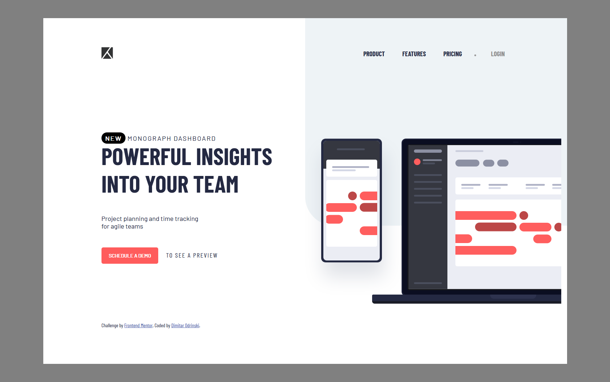
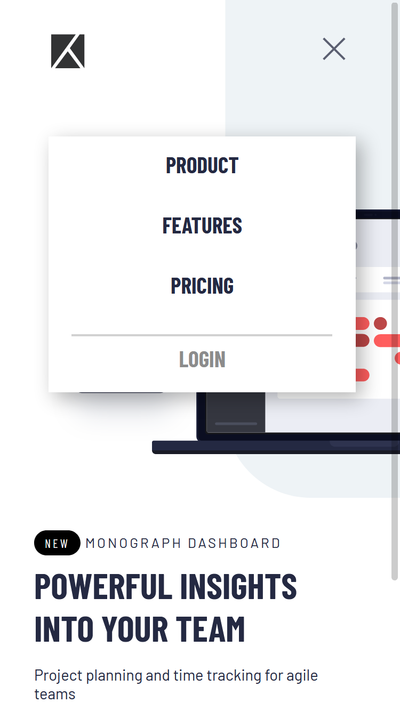
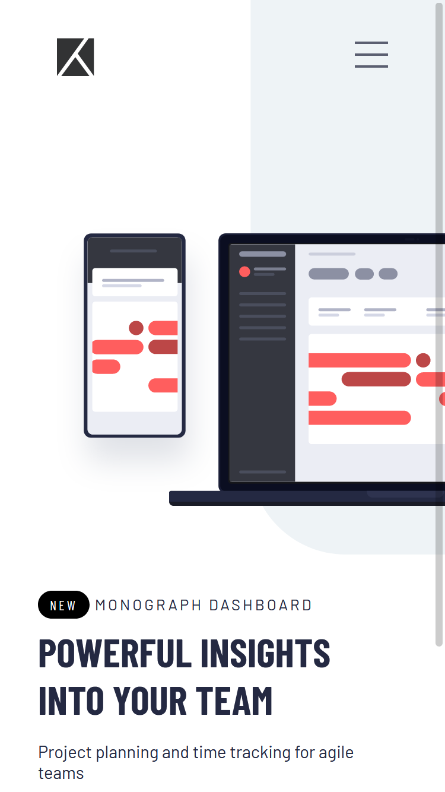

# Frontend Mentor - Project tracking intro component

## Welcome! 👋

[Frontend Mentor](https://www.frontendmentor.io) challenges allow you to improve your skills in a real-life workflow.

## The challenge

Your challenge is to build out this intro component and get it looking as close to the design as possible.

Your users should be able to:

- View the optimal layout for the site depending on their device's screen size
- See hover states for all interactive elements on the page
- Create the background shape using code

## My Solution 

Using only HTML5 and CSS3, I have managed to match the oridinal with good proximity. The webpage is also responsive.

Here are my results:

## Desktop view

## Mobile view

## Challenge specification

The design is to be created to the following widths:

- Mobile: 375px
- Desktop: 1440px

